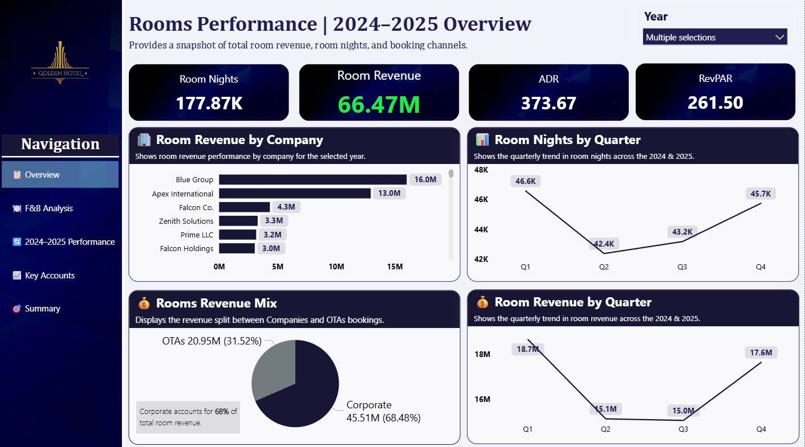
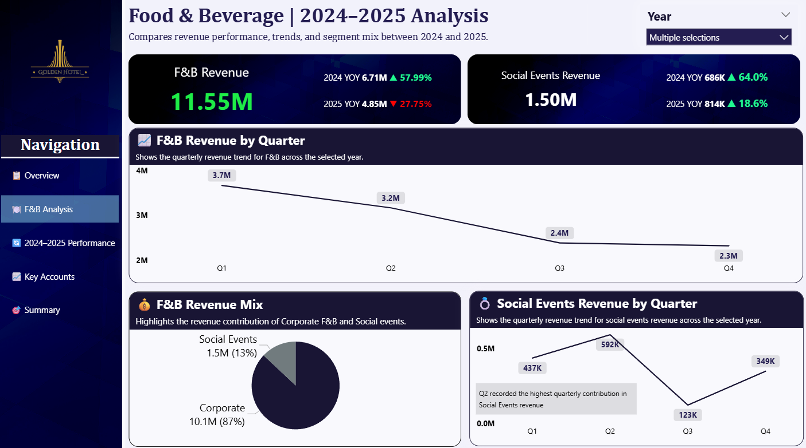
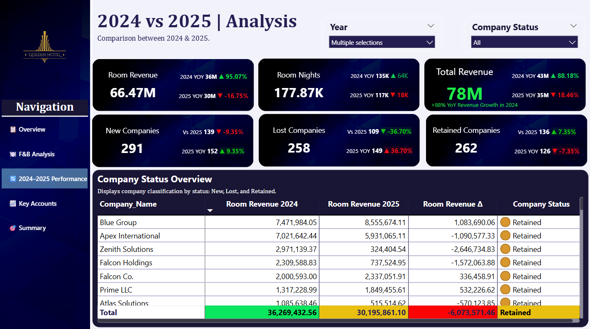
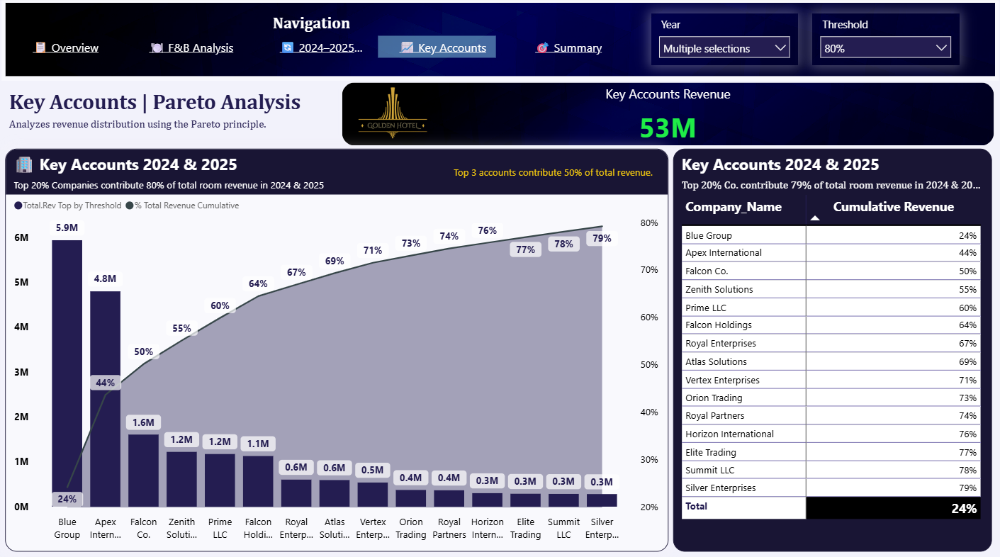
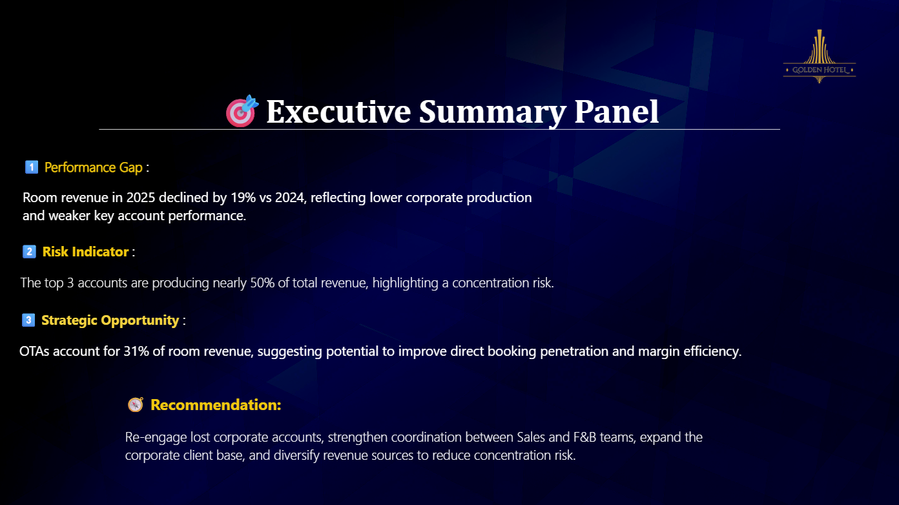

# 🏨 Hotel Revenue Performance Analysis Dashboard

## 📌 Project Overview

This project analyzes hotel revenue performance using a Power BI dashboard to identify the reasons behind revenue gaps and missed budget targets.
The analysis focuses on comparing **2024 vs 2025 performance**, identifying lost corporate accounts, revenue concentration risks, and changes in the business mix.
The objective is to transform operational data into **clear business insights that support better decision-making.**

---

## ❓ Business Problem

Hotel management often asks:

**"Why are we behind the budget despite market activity?"**

Revenue gaps can happen for several reasons:

* Loss of key corporate clients
* Changes in booking channel performance
* High dependence on a small number of accounts
* Seasonal demand fluctuations

This project investigates these factors using structured data analysis.

---

## 🛠 Tools & Technologies

* 📊 Power BI
* 📁 Excel / CSV Dataset
* 📈 Data Modeling
* 📉 Data Visualization

---

# 📊 Dashboard Analysis

---

## 🔎 Overview

Provides a high-level snapshot of hotel performance including:

* Room Revenue
* Room Nights
* ADR (Average Daily Rate)
* RevPAR (Revenue per Available Room)

It also shows the **business mix between Corporate and OTA bookings**.

### Dashboard Preview

---

## 🍽 F&B Revenue Analysis

Explores the contribution of food and beverage revenue to overall hotel performance.

### Dashboard Preview

---

## 📉 Performance Gap Analysis (2024 vs 2025)

This section identifies the **performance gap between both years**.

Key indicators show that **2025 experienced a decline compared to 2024**, particularly in room revenue and room nights.

Corporate clients were categorized into three groups:

* 🆕 **New Accounts** – Companies acquired in 2025
* 🔄 **Retained Accounts** – Existing clients with production changes
* ❌ **Lost Accounts** – Accounts that stopped producing revenue

The analysis revealed that several **high-value accounts from 2024 were lost**, creating a significant revenue gap.

### Dashboard Preview

---

## ⚠️ Pareto Analysis (80/20 Rule)

A Pareto analysis was used to identify revenue concentration risk.

📊 **Key Insight**

The **top 3 companies produce nearly 50% of the total business.**

This concentration represents a major risk since losing one major client can significantly impact revenue performance.

### Dashboard Preview

---

## 💡 Key Insights

* Revenue performance declined in **2025 compared to 2024**
* Several high-value corporate accounts were lost
* New accounts partially compensated but did not fully replace lost revenue
* Revenue is highly concentrated in a small number of clients

---

## 🎯 Business Recommendations

* Re-engage lost corporate accounts
* Strengthen collaboration between **Sales and F&B teams**
* Expand the corporate client base
* Diversify revenue sources to reduce dependency on a few clients

---
## Project Structure

├── README.md
├── images
│   ├── overview.png
│   ├── F&B_analysis.png
│   ├── accounts_analysis.png
│   └── pareto_analysis.png

---

## ⚠️ Disclaimer

The dataset used in this project is based on **publicly available/open-source data** and does not represent the performance of any real hotel.

---

## 👨‍💻 Author

Amr Youssef
Aspiring Data Analyst | Business Intelligence | Hospitality Analytics
